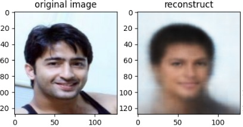
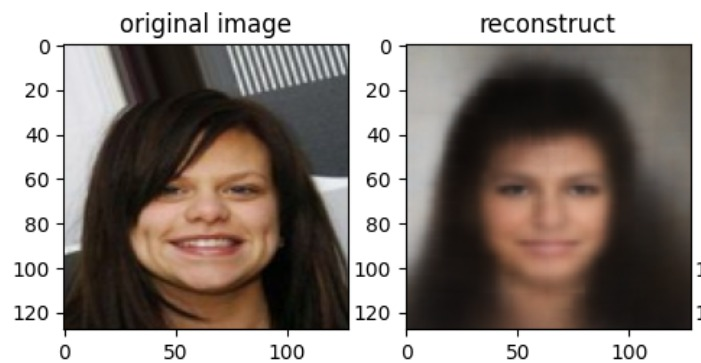

# Facial-Reconstruction-using-VAE

> A deep learning-based image generation framework for facial reconstruction using **Variational Autoencoders (VAEs)**, built on the CelebA dataset and deployed via a custom web interface.

## 🧠 Overview

This project implements a **Convolutional Variational Autoencoder (VAE)** for the **reconstruction and synthesis of human facial images**. Using the large-scale **CelebA dataset**, the model learns a compressed latent representation of faces and reconstructs them with high fidelity.

Key highlights include:
- End-to-end model pipeline: training, evaluation, and deployment.
- Web interface for user interaction: upload images and retrieve VAE-generated outputs in real-time.
- Demonstrates the power of generative models in creative AI, data compression, and face morphing.

## 🎯 Objectives

- Train a convolutional VAE on the CelebA dataset to learn facial representations.
- Generate realistic new facial images from the latent space.
- Provide a web interface where users can interactively upload images and view reconstructed outputs.
- Ensure high-quality reconstructions with a balance of realism and diversity.

## 🚀 Tech Stack

| Component        | Technology                                                                 |
|------------------|----------------------------------------------------------------------------|
| **Programming**  | Python                                                                     |
| **Framework**    | TensorFlow 2.x, Keras                                                       |
| **Web Backend**  | Flask / FastAPI                                                             |
| **Frontend**     | HTML, CSS, JavaScript                                                       |
| **Libraries**    | NumPy, Matplotlib, Scikit-learn                                             |
| **Dataset**      | [CelebA Dataset](https://mmlab.ie.cuhk.edu.hk/projects/CelebA.html)        |
| **Platform**     | Google Colab (training), AWS/Heroku (deployment), Google Drive (storage)   |
| **Others**       | Kaggle API, TensorFlow Datasets, tf.data API                               |

## ✨ Key Features

- 🔁 **Face Reconstruction**: Accurately reconstructs input facial images from a compressed latent vector.
- 🌐 **Web Deployment**: Interactive frontend that allows real-time image uploads and reconstructions.
- 🧬 **Latent Space Sampling**: Generates new, unseen facial images by sampling from the latent space.
- 📈 **Efficient Training**: Model trained using binary cross-entropy loss combined with KL divergence.
- 📦 **Modular Codebase**: Separation between model, training pipeline, and deployment logic.
- 📷 **Visual Outputs**: Includes interpolation, latent traversal, and reconstructed results.

## 🖼️ Demo

### 🔻 Reconstructed Samples
  


### 🌐 Web Interface


> Note: These screenshots depict actual results from our VAE model. The web interface enables interactive use of the model.

## 👨‍💻 Team Members

This project is developed as a part of **B.Tech Pre Final Year Project** under the guidance of **Dr. Shivdutt Sharma** at **IIIT Una**.

- Aditya Kumar Arya (22305)
- Faiz Ahmad (22319)
- Md Umair (22336)

> The team collaborated on model architecture, training, and testing. A full-stack web interface was developed and deployed to enable real-time image interaction.

## 📂 Project Structure

```text
Facial-Reconstruction-using-VAE/
│
├── model/ # VAE model architecture and training scripts
├── web_app/ # Flask/FastAPI backend and frontend files
├── utils/ # Data preprocessing and visualization tools
├── screenshots/ # Screenshots of results and interface
├── notebooks/ # Google Colab training notebooks
├── README.md # This file
└── requirements.txt # Required Python packages
```

## ✅ Performance Highlights

- **Loss Function:** Binary Cross Entropy + KL Divergence
- **Reconstruction Accuracy:** Significant reduction in loss after 30 epochs
- **Inference Time:** 1–3 seconds (GPU)
- **Latent Traversal:** Demonstrates meaningful transformations
- **Web Response Time:** Near real-time, minimal latency on mid-tier cloud deployments

## 📌 Future Scope

- Integrate **Conditional VAEs** for attribute-based face generation.
- Improve image quality using **VAE-GAN hybrids**.
- Add **latent space sliders** on UI for interactive feature manipulation.
- Implement **privacy controls** for uploaded images.
- Launch a **mobile version** for broader accessibility.
- Use creative filters (e.g., Ghibli/cartoon effects) for stylized outputs.

## ❗License

This project is released **without any specific license**. You may view and refer to it for academic or learning purposes.
